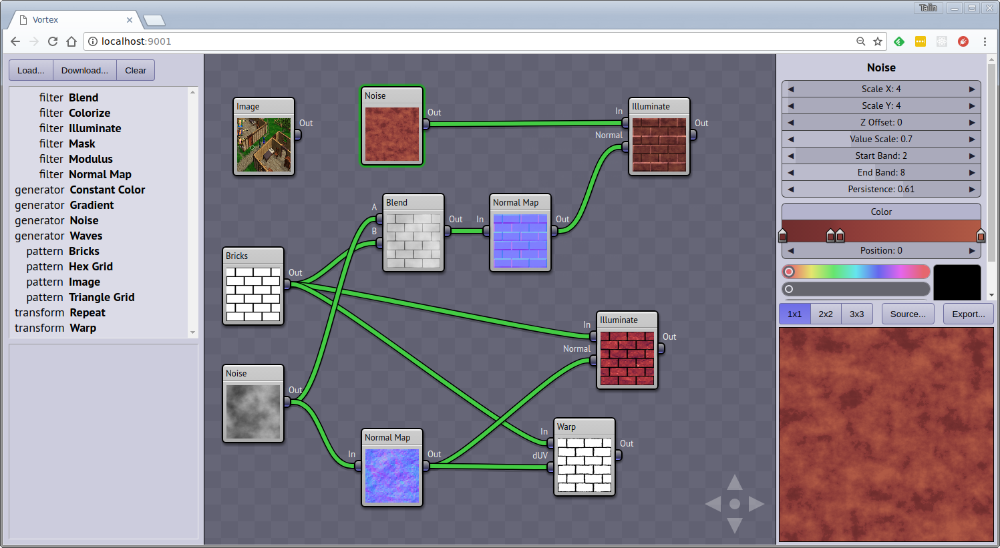

Vortex
======

Vortex is a texture generator application. It's intent is to make it easy to create tileable textures
for use in 3D models.

The actual computation of the images is performed by the GPU using WebGL.

## Screenshot

## Running the application in the Cloud

Go to https://vortex.run

## Using the application

* To create new nodes, drag from the operator table (on the left side panel) into the workspace area.
* To get a detailed description of an operator, select that row in the operator table.
* To delete a node, select a node and then hit the delete key.
* Nodes can be connected via i/o terminals located on the left and right edges of the node.
  * Input terminals are on the left, output terminals are on the right.
  * Create connections by dragging between terminals.
  * You cannot connect an output to an output or an input to an input. Inputs must be connected to outputs.
  * Output nodes can have any number of connections, the signal is copied to all connected inputs.
  * Input nodes can only have one connection. Attempting to add another connection will replace the previous connection.
* When a node is selected, the node's property list will appear on the right panel.
* Node properties are shown as 'combo sliders' which are a combination of slider and text input, very
  similar to the controls in Blender. You can click the arrows, drag left and right, or double-click
  to type in a numeric value directly.
* Editing gradients: Double-click to add or remove a color stop.
* Select the 'Shader' button on the left panel to view the text of the generated OpenGL shader.
* Select the 'Export' button to see a high-res version of the generated image for the current selected node.

## Saving and loading documents

* The 'save' button only appears when the document has never been saved. Once you save the document
  the first time, any additional changes are auto-saved and the save button disappears. (The idea is
  that it doesn't create a database record if you are just playing around.)
* The 'save' button will prompt you to log in if you are not already.
* The 'fork' button creates a new copy of the document under a different name which you can then
  modify.
* The 'load' button displays a dialog of documents that you have created. It is only available
  if you are logged  in.
* Anyone can access your documents if they have the link, but they can't modify your document.
  (They can however fork it.) This means you can share links to a document.
* Click on the document name to rename it.

## Running the application locally

You'll need to create a .env file. See .env-sample. Basically you will need to tell it what kind
of data storage you want to use for documents and images. Currently the only supported image store
is Amazon S3, however it should be easy to create one that uses a local database. For documents
(a.k.a. graphs), you can either use RethinkDB (my favorite database hands down) or AWS DynamoDB. For
the latter (and S3) you'll need an AWS developer account.

One you have a .env file, you can run:

    npm install
    npm run server

Then navigate to http://localhost:9001

### Vortex 2.0

This repository is a complete re-write of the original Vortex code. Changes:

* The biggest change is that Vortex 2.0 is much more focused on improving shader source
  code quality, as opposed to only caring about the images being exported. The hope is to
  make this a platform for general shader development.
* Migrated from Preact to React.
* Migrated from SASS to emotion.
* Converted most components from classes to functions.

## Articles

  * [The technology behind Vortex](https://medium.com/machine-words/the-technology-behind-vortex-a-real-time-browser-based-seamless-texture-generator-b18807fd8865)

## Credits

Vortex was written by Talin.

Vortex is heavily inspired by Holger Dammertz's NeoTextureEdit application. There are a number of
significant differences between the two programs, the biggest of which is the fact that Vortex has
been entirely rewritten in JavaScript and runs entirely in the browser.

## Looking for Contributions

I would be very interested in contributions for additional operator types.

Feel free to create a GitHub issue if you have an idea you'd like to see implemented.

### If you like Vortex, check out some of my other projects:

  * https://github.com/viridia/klendathu
